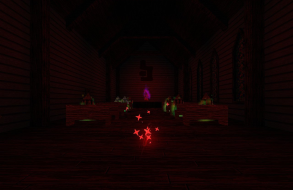
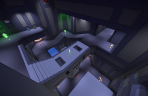
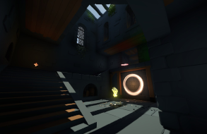

# Ivor 'F14m3z' Weatherill
<table style="width:100%">
  <tr>
    <td style="width:65%">Game Developer, Musician, Live Streamer and Onewheel Rider from the North-West of England. Background in progressive raiding (World of Warcraft), Quake speedrunning and level design for Arena FPS games. Currently working as an independent Game Developer, developing an Colony Simulation game in GameMaker Studio 2. Live streaming on Twitch.tv in the Software & Game Development catagory. Drumming at an intermediate level with a focus on improvisational Rock music. Inspirations include Grateful Dead, Earthless, Phish and My Sleeping Karma. Live a healthy lifestyle and perform frequent strength training. Eat a healthy, balanced diet of home cooked meals and enjoy the great outdoors. If you think I would be a good fit for a particular role, please do not hesitate to reach out.</td>
    <td align="center"></td>
  </tr> 
</table>

## About Me
I have experience with GameMaker Studio 2, GML, Unity, C#, Photoshop, Aseprite, Trenchbroom, Logic, Reaper, Ableton and Pro Tools.

## Skills
- Game Design
- Level Design
- Programming
- Version Control
- Quality Assurance
- Communication
- Documentation
- Drumming
- Pixel Art

## Games
<table>
  <tr>
    <td></td>
  </tr>
  <tr>
    <td>Entheogen is an Colony Simulation game in which you play as a god and perform miracles to help a tribe of humans survive.</td>
  </tr>
</table>

## Level Design
<table>
  <tr>
    <td></td>
    <td></td>
    <td></td>
  </tr>
  <tr>
    <td>Chapel of the Damned is a single player map for the hit Retro FPS game, Dusk.</td>
    <td>Bastion is a 1v1/2v2 map for the Arena FPS game, Reflex Arena.</td>
    <td>Mausoleum is a 1v1 map for the Arena FPS game, Reflex Arena.</td>
  </tr>
</table>

## Contact
You can reach me at f14m3z101@googlemail.com
