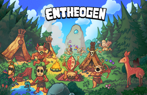

# Ivor 'F14m3z' Weatherill
<table style="width:100%">
  <tr>
    <td style="width:60%">Ivor 'F14m3z' Weatherill is a Game Developer, Musician and Onewheel Rider from the North-West of England. He has a background in progressive raiding in World of Warcraft, Quake               speedrunning and level design for Arena FPS games. Currently he works as an independent Game Developer and is developing an Colony Simulation game in GameMaker Studio 2. He can also be found live                  streaming on Twitch in the Software & Game Development catagory.</td>
    <td></td>
  </tr> 
</table>

## About Me
I have experience with GameMaker Studio 2, GML, Unity, C#, Photoshop, Aseprite and Trenchbroom.

## Skills
- Game Design
- Level Design
- Programming
- Version Control
- Pixel Art

## Games
<table>
  <tr>
    <td></td>
  </tr>
  <tr>
    <td>Entheogen is an Colony Simulation game in which you play as a god and perform miracles to help a tribe of humans survive.</td>
  </tr>
</table>

## Contact
You can reach me at f14m3z101@googlemail.com
